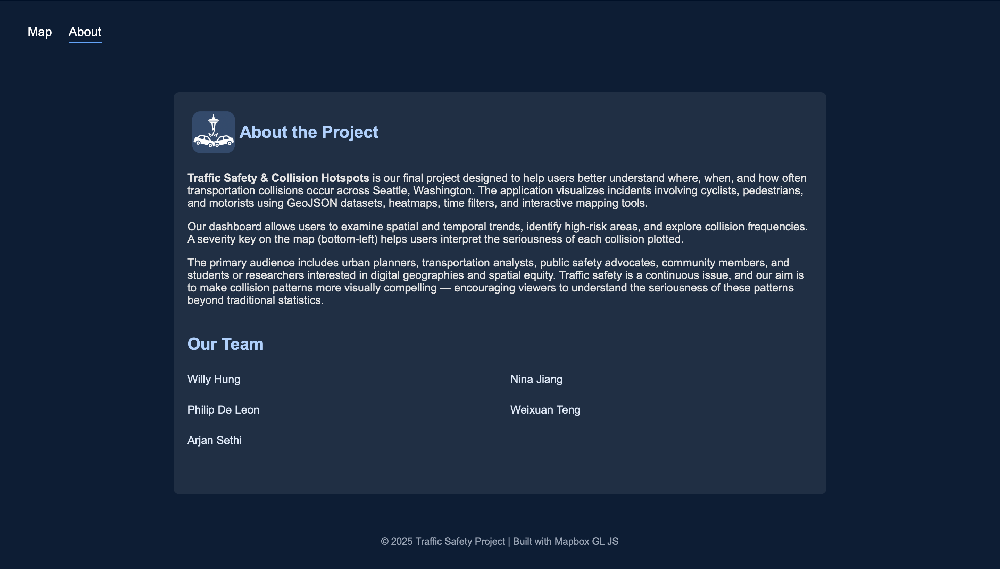
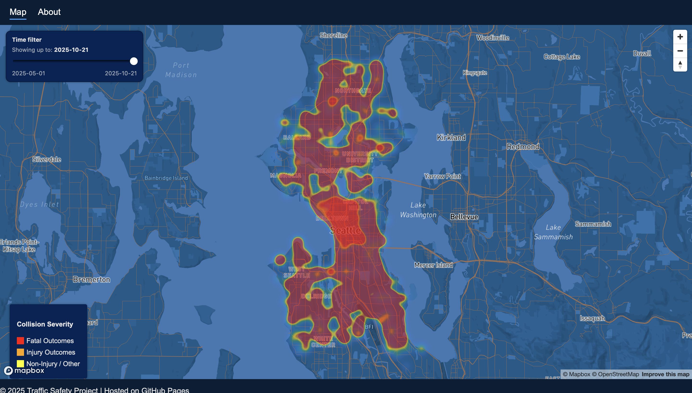

# **Traffic Safety & Collision Hotspots**

## **Project Description**
**Traffic Safety and Collision Hotspots** is our final project, designed to help users understand where, when, and how often transportation collisions involving cyclists, pedestrians, and motorists occur in Seattle, Washington.

Our dashboard allows users to explore temporal and spatial trends, identify collision frequencies at specific locations, and pinpoint high-risk areas. It also highlights where infrastructure gaps may exist, such as missing traffic signals or bike lanes.

The map includes a severity legend (bottom-left). The intended audience includes urban planners, transportation analysts, public safety advocates, community members, and students or researchers interested in digital geographies and spatial equity.

---

## **Project Goal**
Traffic safety and collisions are ongoing issues that impact daily life. Our goal was to create a visual tool that makes these patterns easier to understand. Rather than just presenting statistics, we wanted users to **see** and interact with the data.

---

## **Application URL**
https://willyh23.github.io/traffic-safety-seattle/

---

## **Favicon**

---

## **Screenshots**

### **Screenshot 1**

### **Screenshot 2**

- Interactive heat map showing collision density and severity using **Mapbox GL JS**  
- Time slider to filter collisions by date  
- Zoom/pan for detailed exploration  
- Pop-up tooltips for incident details  
- Legend and UI controls for user-friendly navigation  

---

## **Data Sources**
- **Seattle Department of Transportation (SDOT):** Collision data  
  https://www.seattle.gov/transportation

- **Washington State Department of Transportation (WSDOT):** Traffic counts and roadway safety  
  https://wsdot.public.ms2soft.com

- **Seattle GeoData:** Street networks, bike lanes, and municipal boundaries  
  https://data-seattlecitygis.opendata.arcgis.com

---

## **Data Preprocessing**
We used Python for data preprocessing to prepare the datasets for mapping:

- Removed duplicates  
- Standardized date formats  
- Normalized datasets for consistent mapping  
- Cleaned missing or inconsistent location values  

---

## **Applied Libraries and Web Services**
- **Mapbox GL JS** – Map rendering and visualization  
- **Datetime** – Temporal filtering  
- **JSON** – Data formatting  
- **GitHub** – Version control and hosting  

---

## **Acknowledgments**
Special thanks to:
- **Seattle Department of Transportation (SDOT)**  
- **Washington State Department of Transportation (WSDOT)**  
- **Mapbox** for providing the mapping platform  

---

## **AI Use Disclosure**
We used **GitHub Copilot** and **ChatGPT** to assist with:
- Generating initial code scaffolding  
- Debugging and addressing merge conflicts  
- Improving workflow efficiency  

All final code, documentation, and design decisions were created and reviewed by our team.
